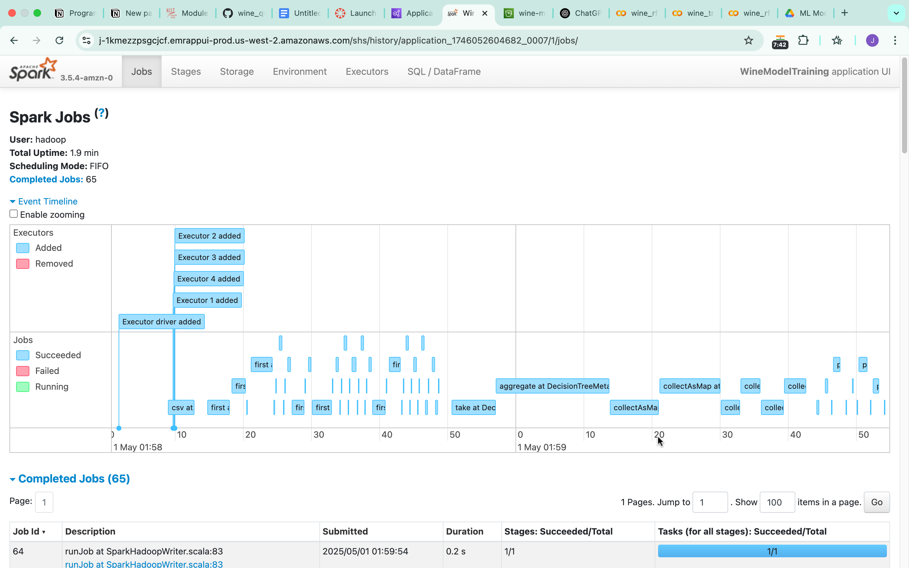
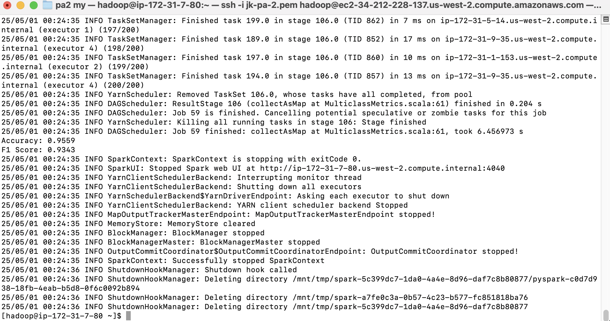
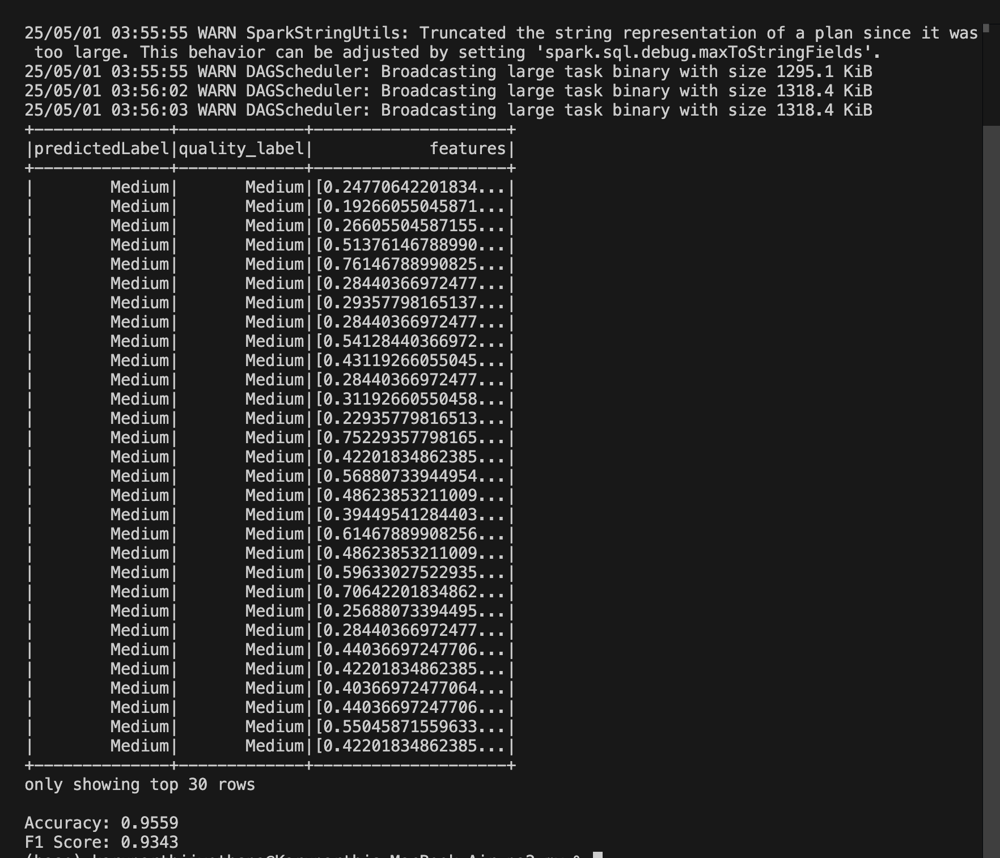

# Wine Quality Prediction on AWS EMR

This repository demonstrates how to train a wine quality prediction model in parallel on an AWS EMR cluster using Apache Spark, and how to deploy and run the model both with and without Docker.

---

## Table of Contents

1. [Prerequisites](#prerequisites)
2. [S3 Bucket Setup](#s3-bucket-setup)
3. [EMR Cluster Setup](#emr-cluster-setup)
4. [Transfer Files to EMR Cluster](#transfer-files-to-emr-cluster)
5. [Training the Model on EMR](#training-the-model-on-emr)
6. [Running Prediction Without Docker](#running-prediction-without-docker)
7. [Dockerization](#dockerization)
   - [Build Docker Image](#build-docker-image)
   - [Push Docker Image](#push-docker-image)
8. [Running with Docker](#running-with-docker)

---

## Prerequisites

- An AWS account with permissions to create S3 buckets and EMR clusters.
- AWS CLI configured locally (`aws configure`).
- A key pair (`.pem` file) for SSH/SFTP access to EMR.
- Docker installed locally (for optional containerized deployment).

---

## S3 Bucket Setup

1. Go to the **AWS Console** and navigate to the **S3** service.
2. Click **Create bucket**, give it a unique name (e.g., `wine-ml-jk773`).
3. Inside the bucket, create a folder named `input-data/`.
4. Upload your **TrainingDataset.csv** and **ValidationDataset.csv** into `input-data/`.

Example S3 URI structure:

```
s3://wine-ml-jk773/
└── input-data/
    ├── TrainingDataset.csv
    └── ValidationDataset.csv
```  

---

## EMR Cluster Setup

1. In the **AWS Console**, select **EMR** and click **Create cluster**.
2. Set a **Cluster name** (e.g., `WineQualityCluster`).
3. Under **Application bundle**, choose **Spark Interactive**.
4. In **Cluster provisioning and scaling**, set **Task 1** instance count to **4** and choose instance type `m4.xlarge`.
5. Under **Cluster logs**, enter your S3 logs path:
   
```
s3://wine-ml-jk773/logs
```

6. Under **Security configuration**, create/select a key pair for SSH/SFTP access.
7. Under **Identity and access**, ensure **EMR_DefaultRole** and **EMR_EC2_DefaultRole** are selected.
8. Click **Create cluster**.


## Transfer Files to EMR Cluster

1. After the cluster is **Ready**, go to **EC2** → **Instances**, and locate the **Master node**.
2. Edit its **Inbound security rules** to allow **SSH (port 22)** from **Anywhere (0.0.0.0/0)**.
3. Copy the **Public DNS** of the Master node.
4. On your local machine, navigate to where your `.pem` key is stored and run:

   ```bash
   sftp -i <your-pem-file>.pem hadoop@<MASTER_PUBLIC_DNS>
   ```

5. In the SFTP session, upload both training and validation files:

   ```sftp
   put wine_rf_training.py
   put wine_rf_prediction.py
   put data/ValidationDataset.csv
   ls   # verify files are uploaded
   ```

---

## Training the Model on EMR

1. SSH into the Master node:

   ```bash
   ssh -i <your-pem-file>.pem hadoop@<MASTER_PUBLIC_DNS>
   ```

2. Verify uploaded files are present:

   ```bash
   ls
   ```

3. Copy files into HDFS:

   ```bash
   hadoop fs -put wine_rf_training.py /user/hadoop/wine_rf_training.py
   hadoop fs -put wine_rf_prediction.py /user/hadoop/wine_rf_prediction.py
   hadoop fs -put ValidationDataset.csv /user/hadoop/ValidationDataset.csv
   ```

4. Launch the training job, which will run on 4 executors:

   ```bash
   spark-submit \
     --master yarn \
     --deploy-mode cluster \
     --conf spark.executor.instances=4 \
     --conf spark.dynamicAllocation.enabled=false \
     --conf spark.executor.cores=4 \
     /home/hadoop/wine_rf_training.py
   ```
Training happened on 4 EMR nodes (executors added in Spark UI):

Models and artifacts will be saved back to your S3 bucket under a predefined prefix in your training script.

---

## Running Prediction Without Docker

1. Ensure you’re still SSH’d into the EMR Master node.
2. Run the prediction script against the validation dataset:

   ```bash
   spark-submit wine_rf_prediction.py --input_csv ValidationDataset.csv
   ```

3. The script will output predictions to the console.


---

## Dockerization

### Build Docker Image

From the root of this repository (where your `Dockerfile` resides), run:

```bash
docker build -t <your-dockerhub-username>/wine-quality-predictor:latest .
```

### Push Docker Image

Log in to Docker Hub and push the image:

```bash
docker login
docker push <your-dockerhub-username>/wine-quality-predictor:latest
```

---

## Running with Docker

1. Pull the container image locally:

   ```bash
   docker pull <your-dockerhub-username>/wine-quality-predictor:latest
   ```

2. Run the container, mounting your local prediction CSV into the container:

   ```bash
   docker run --rm \
     -v <local-path-to-ValidationDataset.csv>:/data/prediction.csv \
     <your-dockerhub-username>/wine-quality-predictor:latest \
     --input_csv /data/prediction.csv
   ```

3. The container will print predictions to the console.


---
